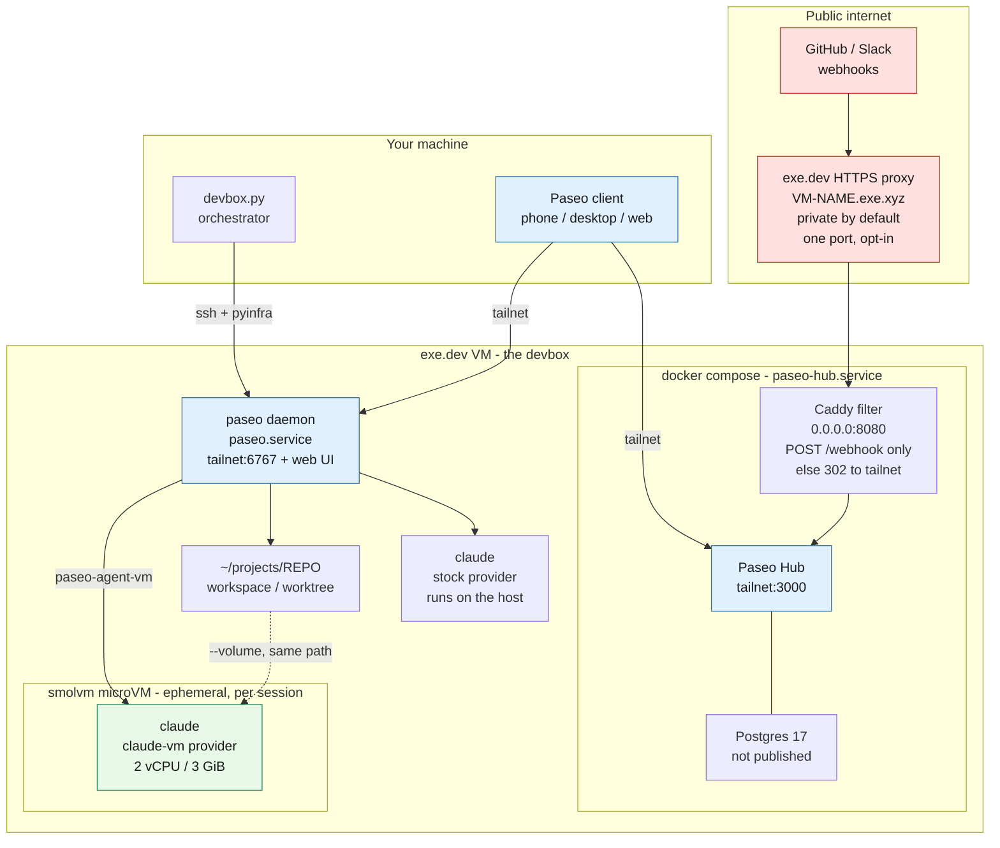

# Devbox setup

A small pyinfra-based tool for setting up a VM for agentic development in the cloud.

> [!NOTE]
> This tool is meant for personal use, and made available online for example / reference purposes only. Please fork and edit yourself if you want to adjust anything.

Stack:

- exe.dev VM
- Tailscale

Creates a "devbox" VM with extra installed tools (above what comes with exeuntu by default):

- node (via NodeSource, current LTS)
- tailscale (w/ssh)
- paseo (daemon autostarted on the tailnet, port 6767)
- paseo hub, self-hosted via docker compose (tailnet, port 3000)
- smolvm (microVM sandbox for paseo agents)

## Architecture



Three boundaries are worth reading off that diagram:

- **The tailnet is the auth boundary.** The daemon (6767) and the Hub dashboard (3000) bind to
  the VM's Tailscale IP only, never `0.0.0.0`. Postgres isn't published at all.
- **Exactly one path is reachable from the public internet**, and only after you opt in with
  `ssh exe.dev share set-public`: `POST /webhook`. The Caddy container redirects everything else
  back to the tailnet, so the Hub UI never answers publicly.
- **Agents are sandboxed only on the `claude-vm` path.** There the agent gets its own kernel and
  sees just the mounted workspace. The stock `claude` provider still runs on the host with your
  credentials — that's the fallback, kept deliberately.

## Prerequisites

- An exe.dev account with an SSH key that has full privileges to create VMs
  and integrations.
- [`uv`](https://docs.astral.sh/uv/).
- The `claude` CLI installed locally.
- A Tailscale account.

## One-time Tailscale setup

Create a Tailscale OAuth client with scope `Devices > Auth Keys` (write), and
define a tag (e.g. `tag:devbox`) with an appropriate owner/`autoApprovers`
entry in your tailnet ACL so the devbox VM can join automatically.

Put the OAuth client id/secret, tailnet, and tag into
`~/.config/devbox/config.toml`:

```toml
ts_oauth_client_id = "..."
ts_oauth_client_secret = "..."
ts_tailnet = "..."
ts_tag = "tag:devbox"
```

Or just leave them out — the first run will prompt for any missing values and
save them there for you.

## One-time Claude setup

The first run invokes `claude setup-token`, which opens a browser locally for
you to authenticate. The resulting token is cached in
`~/.config/devbox/config.toml` so subsequent runs don't need to log in again.

## Usage

Create and provision the VM. The VM name is prompted for on the first run and
cached, so afterwards this is the whole command:

```bash
uv run devbox.py provision [--vm-name <name>]
```

Then enable a GitHub repo as a Paseo project — once per repo:

```bash
uv run devbox.py add-repo <user>/<repo>
```

That creates the exe.dev GitHub integration for the repo, attaches it to the VM,
and registers the clone as a Paseo workspace under `~/projects`. The VM itself is
not tied to any repo; add as many as you like.

Once provisioning finishes, drive the box through Paseo (see below) — pair a
client with the daemon, or open the Hub dashboard. For a shell, plain
`ssh <vm-name>.exe.xyz` still works.

## Paseo

The [paseo](https://paseo.sh) daemon autostarts as a systemd user service, bound
to the VM's Tailscale IP on port 6767 — the tailnet is the auth boundary, since
the daemon can spawn coding agents on the box. To pair a phone or desktop client,
point it at `<devbox-tailnet-name>:6767`, or run on the VM:

```bash
paseo daemon pair --json
```

### Self-hosted Hub

Every devbox also runs [Paseo Hub](https://github.com/getpaseo/hub) — Hub plus
Postgres, via docker compose, managed by the `paseo-hub` systemd user service.
The dashboard is at `http://<devbox-tailnet-name>:3000`, published on the
Tailscale IP only.

The owner email and password are prompted on first run and cached in
`~/.config/devbox/config.toml`. **The password must be at least 12 characters** —
Hub refuses to bootstrap otherwise.

To link the local daemon to the local Hub, log into the dashboard, create an
organization API key, and append it to `~/.config/devbox.env` on the VM (the
daemon wrapper already sources that file):

```bash
export PASEO_HUB_URL=http://<devbox-tailnet-name>:3000
export PASEO_HUB_API_KEY=paseo_pk_...
```

Then `systemctl --user restart paseo`.

### Sandboxed agents

Paseo has no sandboxing of its own — agents normally run as your user, with your
credentials and the whole box in reach. The deploy adds a second provider,
**Claude (microVM)**, selectable per session; the stock `claude` provider is left
untouched, so a broken sandbox never blocks you.

Picking it runs the agent inside an ephemeral [smolvm](https://github.com/smol-machines/smolvm)
microVM via `~/.local/bin/paseo-agent-vm`. Only the workspace directory is
mounted, at the same path inside and out. The agent gets a separate kernel: no
`~/.ssh`, no `~/.config/devbox.env`, no `~/.paseo`, no Hub Postgres, no tailnet
interface, no docker socket.

Two things deliberately still cross the boundary. `CLAUDE_CODE_OAUTH_TOKEN` is
passed in, because the agent has to authenticate. And egress is unrestricted
(`--net`), so the boundary is filesystem and credential isolation, not network
containment — smolvm's `--allow-host` is the lever if you want to tighten that.

The VM is capped at 2 vCPU / 3 GiB (smolvm defaults to 4 vCPU / 8 GiB, more than
this box has), so expect one sandboxed session at a time alongside Hub.

#### The guest image

`deploy/files/paseo-agent.Dockerfile` is the whole contract for what the agent
can reach. It's plain Debian — no language runtime, on the assumption that
projects install their own — plus `git`, `curl`, the natively-installed `claude`,
and the Claude plugins.

Plugins are baked into the image rather than installed on the devbox, because
the microVM mounts only the workspace and so can't see the host's `~/.claude`.
Don't be tempted to mount that directory in: it also holds
`.credentials.json`.

To add a dependency, edit the Dockerfile and re-run the deploy. The build is
guarded on a hash of the Dockerfile, so an edit does trigger a rebuild:

```bash
~/.local/bin/paseo-agent-build     # prints "rebuilt" or "unchanged"
```

For per-project setup, smolvm also reads a `Smolfile` (TOML) with `init`
commands whose results are cached into a reusable artifact — a better fit than
the image for anything repo-specific.

#### Reaching a dev server

Ports `5173`, `8000` and `8081` are forwarded out of the microVM. smolvm can
only bind them on the devbox's `127.0.0.1` — it rejects an IP in the port spec —
so `tailscale serve` republishes each onto the tailnet:

```
agent's dev server :5173  →  devbox 127.0.0.1:5173  →  http://<devbox>.<tailnet>.ts.net:5173
```

Use the full MagicDNS name: `serve` routes by hostname, so the bare tailnet IP
returns 404. Ports are fixed when the VM starts, so point your dev server at one
of the three above. `3000`, `6767` and `8080` are deliberately not in the list —
Hub, the daemon and the webhook filter already hold those on the tailnet.

#### VM cleanup

smolvm runs the VM as `smolvm-bin _boot-vm` in its own process group, so it does
not die with its launcher. Left alone, a killed session strands a microVM that
keeps holding the forwarded ports, and the next session fails to start. The
wrapper handles both cases:

- **SIGTERM/HUP/INT** — a trap stops the launcher and the VM before exiting.
- **SIGKILL** — nothing can run, so the next launch sweeps first. It kills any
  `_boot-vm` under `~/.cache/smolvm/vms/` that has been reparented to init (or
  whose launcher has), then *waits for it to exit* — `kill -9` is asynchronous
  and the dying VM holds its ports long enough to lose the race otherwise.

If you ever run a detached machine deliberately (`machine run -d`), note the
sweep only matches the ephemeral cache path, so named machines are left alone.

### GitHub access

Everything goes through the exe.dev GitHub integration, so no tokens live on the
VM. `git` and `gh` both work on the devbox and inside `claude-vm` microVMs.

Two pieces make the microVM case work. The integration is served on a link-local
address a guest cannot route to, so `paseo-github-proxy.service` forwards the
devbox's `127.0.0.1:443` to `github.int.exe.xyz:443` — smolvm's TSI backend makes
the devbox's loopback reachable from a guest. It's a raw TCP forward, so TLS and
certificate validation pass through untouched. The guest entrypoint then points
the hostname at that loopback, and `GH_HOST` is baked into the agent image.

This is why repos are added with `uv run devbox.py add-repo <user>/<repo>` rather
than through the Paseo UI: the repo needs an exe.dev integration first, and the
clone has to use the integration URL rather than github.com. If you do add one by
hand, use:

```
https://github.int.exe.xyz/<user>/<repo>.git
```

A workspace cloned that way has the right `origin`, so push and pull from inside
the microVM work with no further setup.

Note this is a deliberate hole in the sandbox: any microVM can act with the
integration's authority, including pushing. There is no token for an agent to
steal, but `systemctl stop paseo-github-proxy` revokes access from every microVM
at once, and exe.dev supports `--readonly` integrations if you want a tighter
grant.

### Public webhooks (opt-in)

Provider webhooks are inbound from GitHub/Slack, so they can't reach a
tailnet-only Hub. A Caddy container on port 8080 forwards **only `POST /webhook`**
to Hub and redirects everything else back to the tailnet URL, so the dashboard
never answers publicly. Nothing is internet-reachable until you opt in:

```bash
ssh exe.dev share port <vm-name> 8080
ssh exe.dev share set-public <vm-name>
```

Then set the GitHub App's webhook URL to
`https://<vm-name>.exe.xyz/webhook`, with the secret matching
`GITHUB_WEBHOOK_SECRET` in `~/.config/paseo-hub/hub.env`. Revert exposure with
`ssh exe.dev share set-private <vm-name>`.

## Config

Everything lives in `~/.config/devbox/config.toml` (mode 0600): the VM name, the
Tailscale credentials, the Hub owner login, and the cached Claude token. Missing
values are prompted for on first use and reused thereafter.
