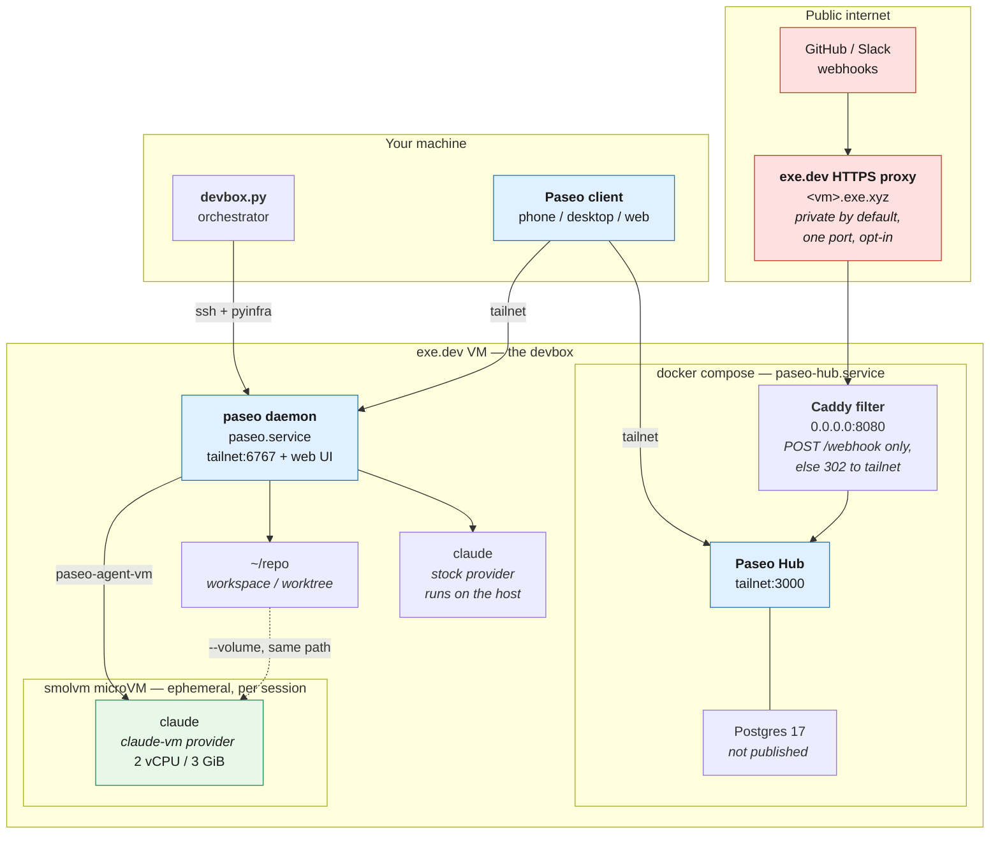

# Devbox setup

A small pyinfra-based tool for setting up a VM for agentic development in the cloud.

> [!NOTE]
> This tool is meant for personal use, and made available online for example / reference purposes only. Please fork and edit yourself if you want to adjust anything.

Stack:

- exe.dev VM
- Tailscale

Creates a "devbox" VM with extra installed tools (above what comes with exeuntu by default):

- fd-find
- node (via NodeSource, current LTS)
- tailscale (w/ssh)
- claude plugins
- paseo (daemon autostarted on the tailnet, port 6767)
- paseo hub, self-hosted via docker compose (tailnet, port 3000)
- smolvm (microVM sandbox for paseo agents)

## Architecture



Three boundaries are worth reading off that diagram:

- **The tailnet is the auth boundary.** The daemon (6767) and the Hub dashboard (3000) bind to
  the VM's Tailscale IP only, never `0.0.0.0`. Postgres isn't published at all.
- **Exactly one path is reachable from the public internet**, and only after you opt in with
  `ssh exe.dev share set-public`: `POST /webhook`. The Caddy container redirects everything else
  back to the tailnet, so the Hub UI never answers publicly.
- **Agents are sandboxed only on the `claude-vm` path.** There the agent gets its own kernel and
  sees just the mounted workspace. The stock `claude` provider still runs on the host with your
  credentials — that's the fallback, kept deliberately.

## Prerequisites

- An exe.dev account with an SSH key that has full privileges to create VMs
  and integrations.
- [`uv`](https://docs.astral.sh/uv/).
- The `claude` CLI installed locally.
- A Tailscale account.

## One-time Tailscale setup

Create a Tailscale OAuth client with scope `Devices > Auth Keys` (write), and
define a tag (e.g. `tag:devbox`) with an appropriate owner/`autoApprovers`
entry in your tailnet ACL so the devbox VM can join automatically.

Put the OAuth client id/secret, tailnet, and tag into
`~/.config/devbox/config.toml`:

```toml
ts_oauth_client_id = "..."
ts_oauth_client_secret = "..."
ts_tailnet = "..."
ts_tag = "tag:devbox"
```

Or just leave them out — the first run will prompt for any missing values and
save them there for you.

## One-time Claude setup

The first run invokes `claude setup-token`, which opens a browser locally for
you to authenticate. The resulting token is cached in
`~/.config/devbox/config.toml` so subsequent runs don't need to log in again.

## Usage

```bash
uv run devbox.py <user>/<repo> [--prefix <prefix>]
```

This creates the exe.dev GitHub integration and VM if they don't already
exist, and provisions the VM via pyinfra.

Once it finishes, drive the box through Paseo (see below) — pair a client with
the daemon, or open the Hub dashboard. For a shell, plain `ssh
<prefix>-<repo>.exe.xyz` still works.

## Paseo

The [paseo](https://paseo.sh) daemon autostarts as a systemd user service, bound
to the VM's Tailscale IP on port 6767 — the tailnet is the auth boundary, since
the daemon can spawn coding agents on the box. To pair a phone or desktop client,
point it at `<devbox-tailnet-name>:6767`, or run on the VM:

```bash
paseo daemon pair --json
```

### Self-hosted Hub

Every devbox also runs [Paseo Hub](https://github.com/getpaseo/hub) — Hub plus
Postgres, via docker compose, managed by the `paseo-hub` systemd user service.
The dashboard is at `http://<devbox-tailnet-name>:3000`, published on the
Tailscale IP only.

The owner email and password are prompted on first run and cached in
`~/.config/devbox/config.toml`. **The password must be at least 12 characters** —
Hub refuses to bootstrap otherwise.

To link the local daemon to the local Hub, log into the dashboard, create an
organization API key, and append it to `~/.config/devbox.env` on the VM (the
daemon wrapper already sources that file):

```bash
export PASEO_HUB_URL=http://<devbox-tailnet-name>:3000
export PASEO_HUB_API_KEY=paseo_pk_...
```

Then `systemctl --user restart paseo`.

### Sandboxed agents

Paseo has no sandboxing of its own — agents normally run as your user, with your
credentials and the whole box in reach. The deploy adds a second provider,
**Claude (microVM)**, selectable per session; the stock `claude` provider is left
untouched, so a broken sandbox never blocks you.

Picking it runs the agent inside an ephemeral [smolvm](https://github.com/smol-machines/smolvm)
microVM via `~/.local/bin/paseo-agent-vm`. Only the workspace directory is
mounted, at the same path inside and out. The agent gets a separate kernel: no
`~/.ssh`, no `~/.config/devbox.env`, no `~/.paseo`, no Hub Postgres, no tailnet
interface, no docker socket.

Two things deliberately still cross the boundary. `CLAUDE_CODE_OAUTH_TOKEN` is
passed in, because the agent has to authenticate. And egress is unrestricted
(`--net`), so the boundary is filesystem and credential isolation, not network
containment — smolvm's `--allow-host` is the lever if you want to tighten that.

The VM is capped at 2 vCPU / 3 GiB (smolvm defaults to 4 vCPU / 8 GiB, more than
this box has), so expect one sandboxed session at a time alongside Hub.

### Public webhooks (opt-in)

Provider webhooks are inbound from GitHub/Slack, so they can't reach a
tailnet-only Hub. A Caddy container on port 8080 forwards **only `POST /webhook`**
to Hub and redirects everything else back to the tailnet URL, so the dashboard
never answers publicly. Nothing is internet-reachable until you opt in:

```bash
ssh exe.dev share port <prefix>-<repo> 8080
ssh exe.dev share set-public <prefix>-<repo>
```

Then set the GitHub App's webhook URL to
`https://<prefix>-<repo>.exe.xyz/webhook`, with the secret matching
`GITHUB_WEBHOOK_SECRET` in `~/.config/paseo-hub/hub.env`. Revert exposure with
`ssh exe.dev share set-private <prefix>-<repo>`.

## Config

Per-repo config is cached under `.devbox/` (gitignored) in the current
directory, so re-running `uv run devbox.py <user>/<repo>` picks up the same
prefix and settings without prompting again.
