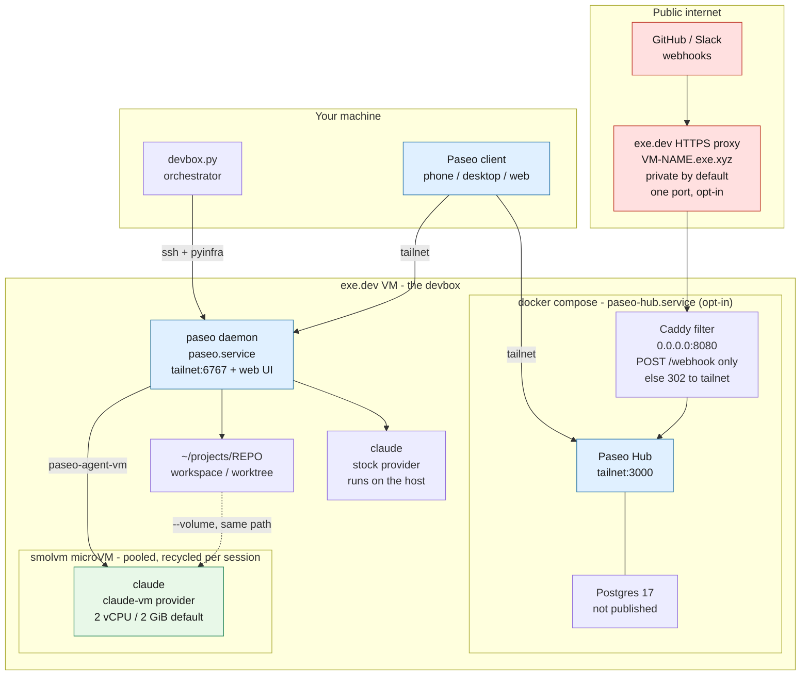

# Devbox setup

A small pyinfra-based tool for setting up a VM for agentic development in the cloud.

> [!NOTE]
> This tool is meant for personal use, and made available online for example / reference purposes only. Please fork and edit yourself if you want to adjust anything.

Stack:

- exe.dev VM
- Tailscale

Creates a "devbox" VM with extra installed tools (above what comes with exeuntu by default):

- node (via NodeSource, current LTS)
- tailscale (w/ssh)
- paseo (daemon autostarted on the tailnet, port 6767)
- smolvm (microVM sandbox for paseo agents)

Paseo Hub is *not* installed by default — it costs ~1.5 GiB of images plus a
running Postgres, which is usually better spent on agent microVMs. Add it with
`devbox.py hub install` (see [Self-hosted Hub](#self-hosted-hub)).

## Architecture



Three boundaries are worth reading off that diagram:

- **The tailnet is the auth boundary.** The daemon (6767) and, if installed, the Hub dashboard
  (3000) bind to the VM's Tailscale IP only, never `0.0.0.0`. Postgres isn't published at all.
- **Exactly one path is reachable from the public internet**, and only after you opt in with
  `ssh exe.dev share set-public`: `POST /webhook`. The Caddy container redirects everything else
  back to the tailnet, so the Hub UI never answers publicly.
- **Agents are sandboxed only on the `claude-vm` path.** There the agent gets its own kernel and
  sees just the mounted workspace and its git dir. The stock `claude` provider runs on the host with your
  credentials — that's the fallback, kept deliberately.

## Prerequisites

- An exe.dev account with an SSH key that has full privileges to create VMs
  and integrations.
- [`uv`](https://docs.astral.sh/uv/).
- The `claude` CLI installed locally.
- A Tailscale account.

## One-time Tailscale setup

Define a tag (e.g. `tag:devbox`) with an appropriate owner/`autoApprovers`
entry in your tailnet ACL so the devbox VM can join automatically, then
[generate an auth key](https://tailscale.com/docs/features/access-control/auth-keys)
in the admin console:

- **Tagged** with your devbox tag. Tagged devices have key expiry disabled, so
  the node stays connected indefinitely; an untagged one would need
  re-authentication after 180 days.
- **Not ephemeral.** An ephemeral node is removed from the tailnet 30–60 minutes
  after going offline and needs to re-authenticate to come back — so stopping
  the VM overnight would strand it, with the key already spent.
- **One-time** is fine, and is all you need. The deploy only runs
  `tailscale up` when the node isn't already joined, so the key is consumed once
  at first join and never touched again. Generate a new one only if you recreate
  the VM.

Put it in `local/config.toml`:

```toml
ts_auth_key = "tskey-auth-..."
```

Or leave it out — the first run prompts for any missing values (with the key
masked) and saves them there for you.

## One-time Claude setup

The first run invokes `claude setup-token`, which opens a browser locally for
you to authenticate. The resulting token is cached in
`local/config.toml` so subsequent runs don't need to log in again.

## Usage

Create and provision the VM. The VM name is prompted for on the first run and
cached, so afterwards this is the whole command:

```bash
uv run devbox.py provision [--vm-name <name>]
```

Then enable a GitHub repo as a Paseo project — once per repo:

```bash
uv run devbox.py add-repo <user>/<repo>
```

That creates the exe.dev GitHub integration for the repo, attaches it to the VM,
and registers the clone as a Paseo workspace under `~/projects`. The VM itself is
not tied to any repo; add as many as you like.

Once provisioning finishes, drive the box through Paseo (see below) by pairing a
client with the daemon. For a shell, plain `ssh <vm-name>.exe.xyz` still works.
If you also want the Hub dashboard, install it with `uv run devbox.py hub install`.

### If provisioning drops mid-run

Long connections through the exe.dev proxy sometimes die part-way, showing up as
`Command socket/SSH error: SSHException('Channel closed.')`. The deploy is
idempotent and retries on two levels — pyinfra re-runs the failed operation, and
the whole run is retried up to three times with a fresh connection — so this
usually recovers by itself.

pyinfra honours `ServerAliveInterval` from your SSH config, which keeps an idle
connection from being dropped in the first place. Worth adding to
`~/.ssh/config`:

```
Host *.exe.xyz
    ServerAliveInterval 30
    ServerAliveCountMax 6
```

## Paseo

The [paseo](https://paseo.sh) daemon autostarts as a systemd user service, bound
to the VM's Tailscale IP on port 6767 — the tailnet is the auth boundary, since
the daemon can spawn coding agents on the box. To pair a phone or desktop client,
point it at `<devbox-tailnet-name>:6767`, or run on the VM:

```bash
paseo daemon pair --json
```

### Self-hosted Hub

[Paseo Hub](https://github.com/getpaseo/hub) — Hub plus Postgres and a Caddy
webhook filter, via docker compose, managed by the `paseo-hub` systemd user
service. It is **opt-in**, because the three images come to ~1.5 GiB and
Postgres stays resident; on a box whose job is running agent microVMs that is
usually the wrong trade. `provision` does not touch it either way:

```bash
uv run devbox.py hub install
uv run devbox.py hub uninstall
```

The dashboard is at `http://<devbox-tailnet-name>:3000`, published on the
Tailscale IP only.

The owner email and password are prompted by `hub install` and cached in
`local/config.toml`. **The password must be at least 12 characters** — Hub
refuses to bootstrap otherwise, so `hub install` rejects a shorter one up front
rather than letting the unit time out.

`hub uninstall` is destructive and takes everything: the containers, all three
images, the Postgres volume, `auth-secret`, `~/.config/paseo-hub`, the clone in
`~/.local/share/paseo-hub`, and the systemd unit. The organization, the owner
login and any API keys go with it — a later `hub install` bootstraps from
scratch. It is safe to run on a box that never had Hub, and safe to run twice.

Two things it deliberately leaves alone: any `PASEO_HUB_*` lines you added to
`~/.config/devbox.env` (below), and a public webhook share, since
`ssh exe.dev share port <vm> 8080` is an exe.dev-side setting — revoke that
yourself if you had opted in.

To link the local daemon to the local Hub, log into the dashboard, create an
organization API key, and append it to `~/.config/devbox.env` on the VM (the
daemon wrapper already sources that file):

```bash
export PASEO_HUB_URL=http://<devbox-tailnet-name>:3000
export PASEO_HUB_API_KEY=paseo_pk_...
```

Then `systemctl --user restart paseo`.

### Sandboxed agents

Paseo has no sandboxing of its own — agents normally run as your user, with your
credentials and the whole box in reach. The deploy adds a second provider,
**Claude (microVM)**, selectable per session; the stock `claude` provider is left
untouched, so a broken sandbox never blocks you.

Picking it runs the agent inside a [smolvm](https://github.com/smol-machines/smolvm)
microVM via `~/.local/bin/paseo-agent-vm`. Only the workspace directory and the
git directory backing it are mounted, at the same paths inside and out. The agent
gets a separate kernel: no `~/.ssh`, no `~/.config/devbox.env`, no `~/.paseo`, no
Hub Postgres, no tailnet reach, no docker socket.

`CLAUDE_CODE_OAUTH_TOKEN` deliberately still crosses the boundary, because the
agent has to authenticate.

#### Egress

Agents get the public internet and nothing else. smolvm's egress policy is an
allowlist — `--allow-cidr`, with no deny flag — so the block has to be written as
the complement of what should be out of reach. That complement is generated by
`~/.local/bin/paseo-agent-egress` rather than hand-maintained, because it is 48
IPv4 CIDRs and a typo in any one of them is a silent hole:

| denied | why |
| --- | --- |
| `100.64.0.0/10` | CGNAT — the whole tailnet, including MagicDNS `100.100.100.100` |
| `10/8`, `172.16/12`, `192.168/16` | RFC1918, including the docker bridges Hub and Postgres sit on |
| `169.254.0.0/16` | link-local, including the exe.dev integration address |
| all IPv6 | the family is allowed nowhere, which excludes the tailnet ULA `fd7a:115c:a1e0::/48` and link-local by omission — see below for why it is denied rather than narrowed |

One hole is deliberate. `100.96.0.0/30` — the guest's own NAT link, where `eth0`
is `100.96.0.2` and the gateway `100.96.0.1` is the host — stays allowed, because
that gateway is the address `agent-entry` points `github.int.exe.xyz` at. Denying
it would take git and gh down along with the tailnet. No tailnet node lives in
that /30.

This is the control that keeps an agent off the tailnet, and it is worth being
precise about why it is needed: smolvm NATs the guest through the host, so an
unrestricted guest can reach whatever the host can. Before the policy existed, one
could read the host tailscaled's *unauthenticated* web API on `100.100.100.100` —
tailnet name, owner, device addresses — and get an HTTP 200 from the tailnet-only
daemon on `100.94.153.34:6767`. An in-guest firewall would not have helped, since
the agent runs as root and could flush it; this is enforced host-side, inside
smolvm's network stack.

The policy is applied at `machine create`, in both the pool build and the
post-session rebuild. `machine update` has no egress flags, but the create-time
policy survives it, which is what makes the pool model work. To see what an agent
tried to reach and was refused:

```bash
smolvm machine egress-events --name paseo-agent-1
```

Note that DNS is intercepted by smolvm's netstack, so a guest can still *resolve*
MagicDNS names even though it cannot connect to them.

IPv6 is denied outright rather than narrowed to global unicast, because a v6
range that is allowed but unroutable is worse than one that is closed. smolvm has
no working v6 egress, but its netstack terminates the connection to an *allowed*
v6 address locally and only then fails to forward it — so the guest sees a
successful connect, Happy Eyeballs commits to that path, and the client never
falls back to the v4 address that would have worked. The symptom was a plain
`curl https://pypi.org` dying mid-TLS in the sandbox while `curl -4` against the
same host returned 200. `agent-entry` also disables v6 on the guest's egress
interface, which drops the scope-global ULA smolvm assigns and stops
`getaddrinfo` returning AAAA records at all; the allowlist is the control, and
the interface change is what keeps clients from reaching for v6 to begin with.

By default there are two VMs at 2 vCPU / 2 GiB each, so at most two sandboxed
sessions run at once. A session beyond that is refused with a message rather
than left to the OOM killer. That default is sized for the worst case, a box
also running Hub and Postgres.

Both numbers are provisioning flags, cached in `local/config.toml` like the VM
name, so you set them once:

```bash
uv run devbox.py provision --agent-pool-size 3 --agent-memory 4096
```

`--agent-memory` is MiB per microVM, matching smolvm's `--mem`. vCPUs stay at 2
and have no flag.

The deploy refuses a pool the box cannot hold. Every pool machine can be running
at once, so it checks `pool-size x memory` against `MemAvailable` on the VM and
fails with the numbers it used and a size that would fit:

```
  requested   8 microVMs x 2048 MiB = 16384 MiB
  available   6804 MiB (of 7935 MiB total)
```

The check runs *before* anything is written, so a refused geometry leaves the
box exactly as it was — the existing pool keeps running. It measures available
rather than total memory, which means an active sandboxed session (holding its
machine's memory) or an installed Hub and Postgres both count against you.
`devbox.py hub uninstall` frees roughly half a gigabyte if you don't use it.

Changing either value rewrites `~/.config/paseo-agent/pool.env`, which is
hashed into the image build stamp — so the next provision restocks the pool
rather than leaving machines running the old geometry. Shrinking the pool
deletes the machines that fall outside it.

#### Why a pool

Paseo aborts agent start after 15s — `AGENT_RUN_START_TIMEOUT_MS`, hardcoded in
`@getpaseo/server` with no config or environment override — and surfaces nothing
but `timeout`. Booting a microVM from scratch does not fit inside that: smolvm
re-flattens the image inside the guest on *every* boot, which measured **16.3s on
an idle box** and far worse under load.

That is not a delivery-mechanism problem. Measured here:

| launch path | time to run a command in the guest |
| --- | --- |
| `machine run --image <docker save tar>` | 16.3s |
| `machine run --from <packed .smolmachine>` | 26.1s |
| `machine run --oci-cache` (warm cache) | 25.7s |
| **`machine start` on a pre-flattened machine** | **1.6s** |

The packed and cached paths are *slower*, because rehydrating a compressed
artifact costs more CPU than flattening the archive. (`--oci-cache` also prints
its status line to stdout, which would corrupt the agent's protocol stream.)
Shrinking the image cannot close the gap either — 324MB of it is the single
`claude` binary.

So the deploy pre-builds a small pool of machines that have already paid the
flatten. A session claims one, has its workspace mounted in while the machine is
stopped — `machine exec` has no `--volume`, so mounts are swapped between runs —
and starts it.

To keep the freshness an ephemeral VM would have given, a used machine is
destroyed and rebuilt **after** the session ends, in the background and off the
critical path. A claimed machine therefore always has a clean root filesystem.

#### The guest image

`deploy/files/paseo-agent.Dockerfile` is the whole contract for what the agent
can reach. It's plain Debian — no language runtime, on the assumption that
projects install their own — plus `git`, `curl`, the natively-installed `claude`,
and the Claude plugins.

Plugins are baked into the image rather than installed on the devbox, because
the microVM mounts only the workspace and so can't see the host's `~/.claude`.
Don't be tempted to mount that directory in: it also holds
`.credentials.json`.

Everything in the guest runs as root, and Paseo drives the agent in
`bypassPermissions` mode — a combination Claude Code refuses outright, exiting 1
with `--dangerously-skip-permissions cannot be used with root/sudo privileges`.
The image sets `IS_SANDBOX=1`, the escape hatch that guard checks for, because
what the guard protects doesn't exist here: the machine at stake is a microVM
containing nothing but the session's workspace, thrown away after every session.
Guest root doesn't reach the host either — smolvm shares files as the
unprivileged devbox user, so a file the agent creates in the workspace lands
owned by `exedev`, not `root`.

To add a dependency, edit the Dockerfile and re-run the deploy. The build is
guarded on a hash of the Dockerfile, the entrypoint and the build script itself,
so an edit to any of them triggers a rebuild — and a rebuild restocks the pool,
since stale machines would still be running the old image:

```bash
~/.local/bin/paseo-agent-build     # prints "rebuilt" or "unchanged"
```

Expect a few minutes: it rebuilds the image and then boots each pool machine once
to pay the flatten up front.

For per-project setup, smolvm also reads a `Smolfile` (TOML) with `init`
commands whose results are cached into a reusable artifact — a better fit than
the image for anything repo-specific.

#### Reaching a dev server

Ports `5173`, `8000` and `8081` are forwarded out of the microVM. smolvm can
only bind them on the devbox's `127.0.0.1` — it rejects an IP in the port spec —
so `tailscale serve` republishes each onto the tailnet:

```
agent's dev server :5173  →  devbox 127.0.0.1:5173  →  http://<devbox>.<tailnet>.ts.net:5173
```

Use the full MagicDNS name: `serve` routes by hostname, so the bare tailnet IP
returns 404. Ports are fixed when the VM starts, so point your dev server at one
of the three above. `3000`, `6767` and `8080` are deliberately not in the list —
the daemon holds 6767, and 3000 and 8080 stay reserved for Hub and its webhook
filter even on a box where Hub isn't installed, so a later `hub install` can't
collide with a forwarded port.

#### Pool lifecycle and cleanup

The pool is `paseo-agent-1` … `paseo-agent-N` for `--agent-pool-size` N,
default two — visible in `smolvm machine ls`.
A session:

1. claims a machine with an atomic lock file under `~/.cache/paseo-agent-vm/`;
2. mounts its workspace and git dir into the stopped machine, then starts it;
3. runs the agent with `machine exec -i`, passing the token via `--secret-env` so
   it reaches neither the machine record nor `ps` output;
4. on exit, stops the machine and rebuilds it in the background — releasing the
   lock only once the replacement is ready, so a half-built machine is never
   claimable.

Two failure modes are handled explicitly:

- **SIGTERM/HUP/INT** — forwarded to the exec, then the machine is stopped and
  recycled as normal.
- **SIGKILL** — nothing can run, so the lock is left behind. It records the owning
  PID, and the next session reclaims any lock whose process is gone.

A machine that comes back with mounts still attached is refused and recycled
rather than reused, so one session's workspace can never show up in the next.

Background rebuilds log to `~/.cache/paseo-agent-vm/recycle.log`. If the pool is
ever lost entirely, `~/.local/bin/paseo-agent-build` restocks it.

### GitHub access

Everything goes through the exe.dev GitHub integration, so no tokens live on the
VM. `git` and `gh` both work on the devbox and inside `claude-vm` microVMs.

Two pieces make the microVM case work. The integration is served on a link-local
address a guest cannot route to, so `paseo-github-proxy.service` forwards the
devbox's `127.0.0.1:443` to `github.int.exe.xyz:443` — smolvm's TSI backend makes
the devbox's loopback reachable from a guest. It's a raw TCP forward, so TLS and
certificate validation pass through untouched. The guest entrypoint then points
the hostname at that loopback, and `GH_HOST` is baked into the agent image.

This is why repos are added with `uv run devbox.py add-repo <user>/<repo>` rather
than through the Paseo UI: the repo needs an exe.dev integration first, and the
clone has to use the integration URL rather than github.com. If you do add one by
hand, use:

```
https://github.int.exe.xyz/<user>/<repo>.git
```

A workspace cloned that way has the right `origin`, so push and pull from inside
the microVM work with no further setup.

Note this is a deliberate hole in the sandbox: any microVM can act with the
integration's authority, including pushing. There is no token for an agent to
steal, but `systemctl stop paseo-github-proxy` revokes access from every microVM
at once, and exe.dev supports `--readonly` integrations if you want a tighter
grant.

### Public webhooks (opt-in)

Only relevant if you ran `hub install` — the Caddy filter is part of that stack.

Provider webhooks are inbound from GitHub/Slack, so they can't reach a
tailnet-only Hub. A Caddy container on port 8080 forwards **only `POST /webhook`**
to Hub and redirects everything else back to the tailnet URL, so the dashboard
never answers publicly. Nothing is internet-reachable until you opt in:

```bash
ssh exe.dev share port <vm-name> 8080
ssh exe.dev share set-public <vm-name>
```

Then set the GitHub App's webhook URL to
`https://<vm-name>.exe.xyz/webhook`, with the secret matching
`GITHUB_WEBHOOK_SECRET` in `~/.config/paseo-hub/hub.env`. Revert exposure with
`ssh exe.dev share set-private <vm-name>`.

## Config

Everything lives in `local/config.toml` inside the checkout (mode 0600, in a
0700 directory): the VM name, the Tailscale auth key, the cached Claude token,
the sandbox pool size and per-VM memory, and — only once you run `hub install` —
the Hub owner login. Missing values are
prompted for on first use and reused thereafter, and each command asks only for
what it needs: `provision` never prompts for the Hub login, and `add-repo` and
`hub uninstall` want nothing but the VM name.

`local/` is gitignored, so these values can't be committed by accident. Because
the config travels with the clone rather than living in `~/.config`, a second
checkout gets its own config — and deleting the checkout deletes the secrets
with it.
